# SK-CERT - BROKEN OPTIMIZER
> Používateľ v tvojej firme si nainštaloval tento software, aby si zvýšil výkon PC, ale miesto toho sa mu počítač začal správať divne. Zisti, čo sa stalo. https://drive.google.com/file/d/1Z8tOGNpiz6uPlDTK6G9r7b4kiZ8FTSgf/view?usp=share_link </br>
Reported Difficulty: 1

## 1 Optimizer
> Webstránka šírila program pre optimalizáciu PC, avšak nevyzerá legitímne. Čo vlastne robí?

> Body: 3

<details>
<summary>Zobraziť riešenie</summary>

Z uvedeného linku obstaráme súbor `oprimizer.sh` čo je [Bash script](https://en.wikipedia.org/wiki/Bash_(Unix_shell)) a vidíme, že vykonáva nejaké inštrukcie, ktoré sú zakódovane v `base64`. Stačí si iba tie inštrukcie dekódovať a objaví sa flag:

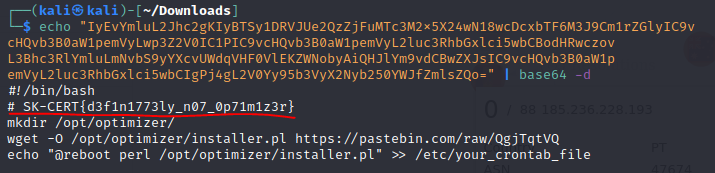

```
flag: SK-CERT{d3f1n1773ly_n07_0p71m1z3r}
```
</details>

## 2 What it do?
> Sťahujeme perl? Pustime sa do toho!

> Body: 3

<details>
<summary>Zobraziť riešenie</summary>

Podlá návodu sa ideme pozrieť do spomínaného [perl](https://en.wikipedia.org/wiki/Perl) súboru. Stihnem si ho do `Downloads` adresára:


Po krátkej [statickej analýze](https://en.wikipedia.org/wiki/Static_program_analysis) som rozdelil kód na 3 časti:

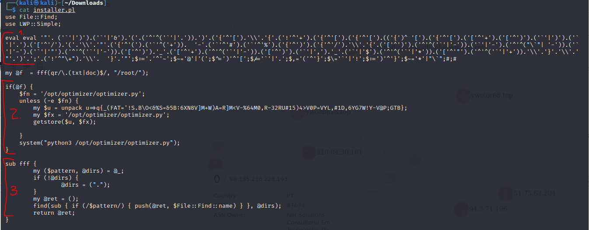

1. Nejaká premenná alebo funkcia, ktorá je [obfuskovana](https://en.wikipedia.org/wiki/Obfuscation_(software)) a treba ju rozlúštiť.
2. V tejto časti sa nejak rozbalí alebo stiahne [python](https://en.wikipedia.org/wiki/Python_(programming_language)) program, ktorý bude asi súčasťou ďalšej úlohy.
3. Funkcia, ktorá vyhľadá všetky `.doc` a `.txt` súbory v `/root/` adresári.

Na deobfuskáciu prvej časti som použil [dynamickú analýzu](https://en.wikipedia.org/wiki/Dynamic_program_analysis) a pri týchto obfuskáciach často stačí iba priradiť výsledok ku premennej a vytlačiť ju:

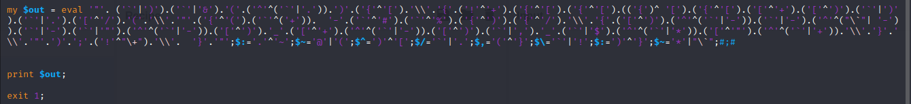

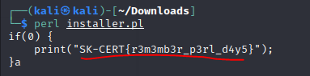

Poznámka: trvalo mi kým som zistil, že treba odstrániť druhý `eval`.

```
flag: SK-CERT{r3m3mb3r_p3rl_d4y5}
```
</details>

## 3 Chaos
> Robí to aj niečo viac. Vieme zistiť čo?

> Body: 3

<details>
<summary>Zobraziť riešenie</summary>

Táto úloha sa nadväzuje na tú predchádzajúcu, v podstate som najprv vyriešil túto úlohu ale flag nesedel :). Takže, na riešenie tejto úlohy sa vrátim k druhej časti kódu, kde treba rozbaliť ten pyhon kód. Tak ako v predchádzajúcej úlohe, skúsim tu premennú vytlačiť, ale predtým musím zmeniť podmienku `if(@f)` na `if(1)`, aby som sa netrápil tým, čo to za podmienku vlastne je.

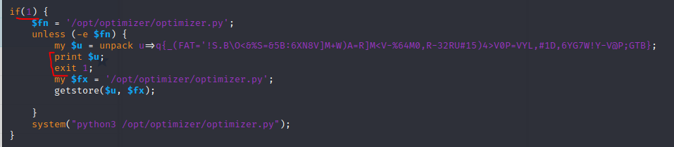

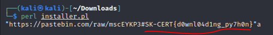

```
flag: SK-CERT{d0wnl04d1ng_py7h0n}
```
</details>

## 4 Another file
> Ok, vyzerá to, že sa sťahuje ďalší súbor, poďme ho zanalyzovať.

> Body: 3

<details>
<summary>Zobraziť riešenie</summary>

Takže, ten perl `installer.pl` si stiahne kód z `https://pastebin.com/raw/mscEYKP3`, tak sa na to pozrime:

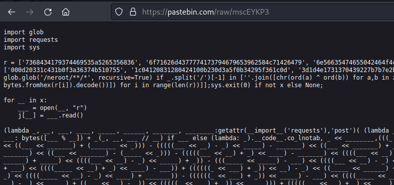

Tak to vyzerá hrozne... ďalšia obfuskácia... ughh. Poďme tak ako v predošlom prípade, najprv si rozdelím kód na jednotlivé časti a potom skúsim každú riešiť individuálne.
Prvá časť kódu, ktorá vyzerá ako obfuskácia pomocou [list comprehension](https://docs.python.org/3/tutorial/datastructures.html#list-comprehensions)

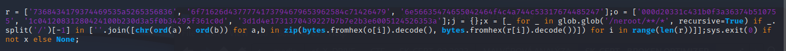

Trošku si to upracem aby som videl čo sú premenné a čo je zoznam:

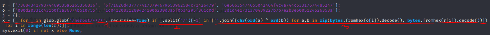

Vidím, že sú tam premenné `r`, `o`, `j` a posledná `x`, ktorá je zaujímavá keďže sa tam deje deobfuskácia. Tak si ju rozdelím na 3 časti:

1. `_ for _ in glob.glob('/neroot/**/*', recursive=True)` - čítam to zatiaľ ako "pre niečo v niečom"...
2. `if _.split('/')[-1] in` - "ak niečo v" zozname...
3. `[''.join([chr(ord(a) ^ ord(b)) for a,b in zip(bytes.fromhex(o[i]).decode()....` - a práve táto časť je najzaujímavejšia lebo je to zoznam v ktorom sa bude nachádzať konečný výsledok manipulácie charaktermi.

Tak si tú 3. časť dám do samostatného python súboru a pokúsim sa zistiť výslednú formu toho zoznamu:

```
import glob
import requests
import sys

r = ['7368434179374469535a5265356836', '6f71626d4377774173794679653962584c71426479', '6e56635474655042464f4c4a744c53317674485247'];
o = ['000d20331c431b0f3a36374b510755', '1c04120831280424100b230d3a5f0b34295f361c0d', '3d1d4e1731370439227b7b7e2b3e6005124526353a'];
j = {};
x = [''.join([chr(ord(a) ^ ord(b)) for a,b in zip(bytes.fromhex(o[i]).decode(), bytes.fromhex(r[i]).decode())]) for i in range(len(r))]
print(x)

```

Keď ten python súbor vykonáme, bingo!

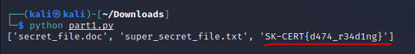

```
flag: SK-CERT{d474_r34d1ng}
```
</details>

## 5 Attacker
> Takže python číta naše údaje, čo s nimi urobí ďalej?

> Body: 3

<details>
<summary>Zobraziť riešenie</summary>

Napovedá hovorí, že python číta naše údaje a s nimi niečo robí. Z predchádzajúcej úlohy vieme, že prvá časť toho python skriptu hľadá súbory `secret_file.doc` a `super_secret_file.txt` v `/neroot/**/*` adresári a podadresároch, a podlá `import requests` predpokladám, že ich potom niekam posiela.

Ďalší krok je tiež dynamická analýza, a aby skript fungoval vytvoríme adresárovú štruktúru `./fake/` a pridám `secret_file.doc` a `super_secret_file.txt` súbory - upravil som časť `glob.glob('./fake/**/*', recursive=True)` aby som si zbytočne nezapratával `/`.

Po spustení skriptu, zadá sa, že nefunguje, dostal som chybu:
```
urllib3.exceptions.MaxRetryError: HTTPConnectionPool(host='attacker.attacker', port=80): Max retries exceeded with url: / (Caused by NewConnectionError('<urllib3.connection.HTTPConnection object at 0x7f211dc93c70>: Failed to establish a new connection: [Errno -2] Name or service not known'))
```

`attacker.attacker` je neplatný host, čo znamená, že úlohou programu nie je odoslať dáta na platnú adresu, takže skúsim sa pozrieť či viem zachytiť ten request vo [Burp proxy](https://portswigger.net/burp/documentation/desktop/tools/proxy). Naštartujem Burp v Kali, do shellu nastavím proxy `export http_proxy=http://localhost:8080` aby všetky requesty zo shellu išli cez Burp a pustím program:

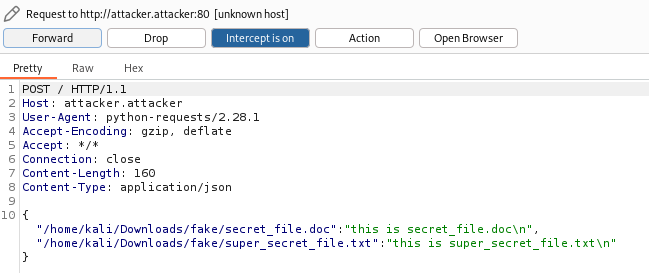

Z odchytenej komunikácie som ale nič nezistili. Po dlhšom pátraní a skúšaní rôznych veci som sa ubral cestou, že možno cela ta ofuskovana lambda funkcia vráti predsa niečo zaujímavé ale nevypíše to na stdout. Tak som response priradil do premennej a po niekoľkých iteráciách som sa dopracoval, že je to [response object](https://www.w3schools.com/python/ref_requests_response.asp) a [spôsob ako vypísať všetky atribúty](https://stackoverflow.com/a/192184):

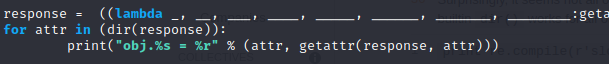

Po spustení programu som získal flag z `response.url` atribútu:

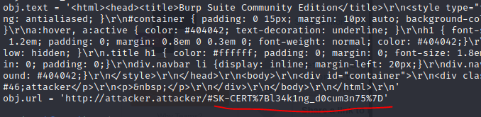

```
flag: SK-CERT{l34k1ng_d0cum3n75}
```
</details>
