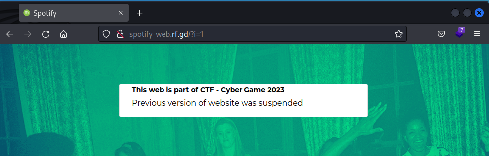
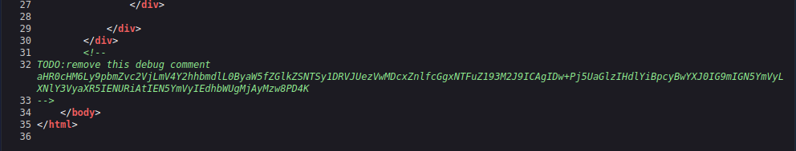
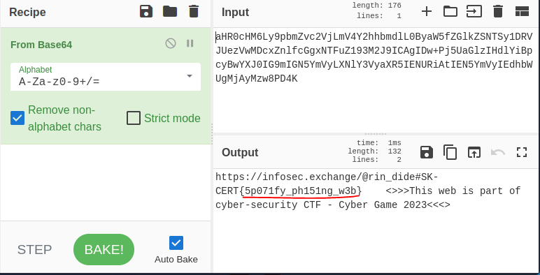
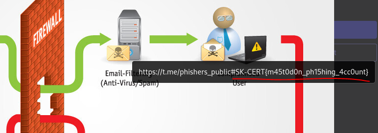
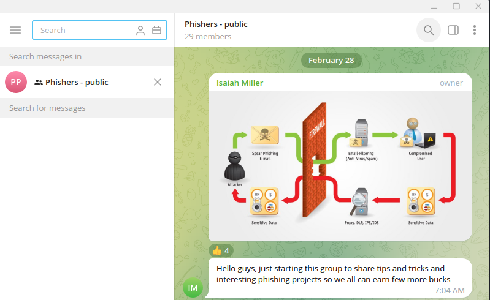
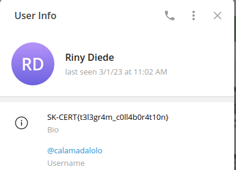
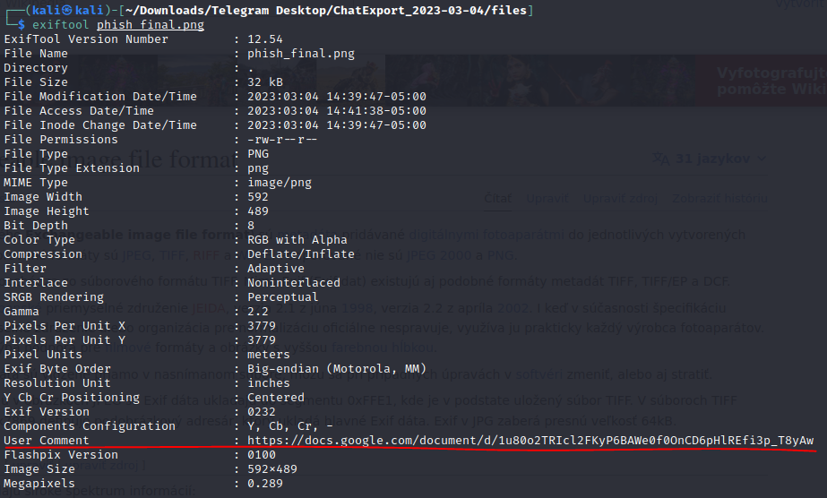
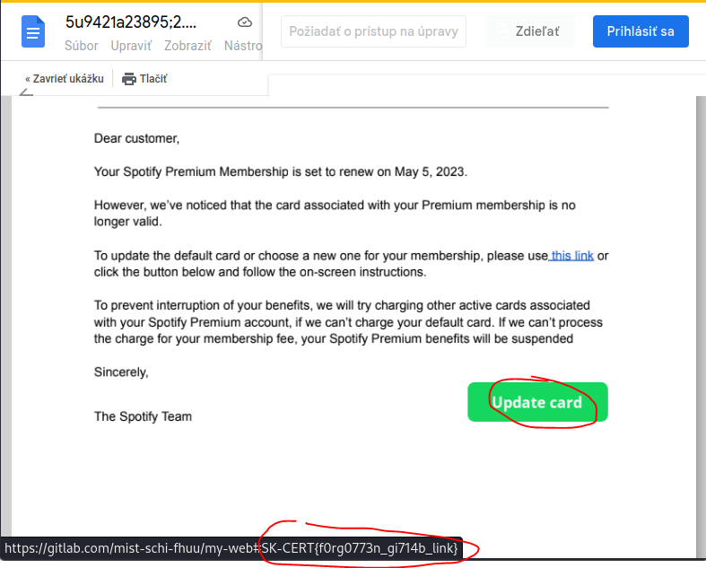
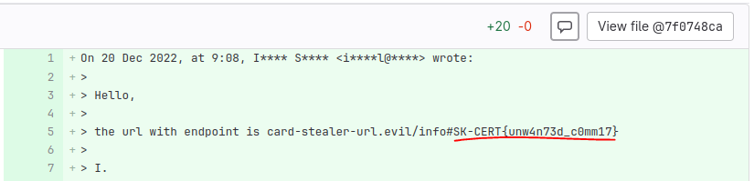

# SK-CERT - PHISHING
> Boli ste cieľom phishingovej kampane. Rozhodli ste sa túto kampaň zanalyzovať.<br/>
Reported Difficulty: 1

## 1 Phishing link  
> Linka v phishingovej kampani je http://spotify-web.rf.gd/  a zameriava sa na kradnutie informácií kreditných kariet

> Body: 3

Navštevujeme stránku `http://spotify-web.rf.gd/`, a ako sa dalo očakávať, nič tam zaujímavé nie je:



Ďalší krok, štandardne je pozrieť si zdrojový kód, a tam už niečo zaujímavé nachádzam:



Vyzerá to na nejakú kódovanú správu, skúšam [base64](https://en.wikipedia.org/wiki/Base64) na vernom [CyberChef](https://gchq.github.io/CyberChef/), a vidím známy formát:



```
flag: SK-CERT{5p071fy_ph151ng_w3b}
```

## 2 Network
> Sociálna sieť, viete z nej zistiť niečo užitočné?

> Body: 3

Z predchádzajúcej úlohy v dekódovanom base64 stringu sa ukrýval, okrem flagu, aj zaujímavý odkaz `https://infosec.exchange/@rin_dide`. Otvorením odkazu vidím, že je to link na sociálnu sieť [Mastodon](https://en.wikipedia.org/wiki/Mastodon_(social_network)), ktorá sa v ostatom čase stala populárnou (žeby vďaka Elonovi?).

Sú tam iba dva posty, na prvý pohlaď nič zaujímavé, žiadne ďalšie odkazy, iba obrázok v ktorom, pri hľadaní nejakej nápovedy náhodou zachytím [alt text](https://en.wikipedia.org/wiki/Wikipedia:Manual_of_Style/Accessibility/Alternative_text_for_images) kde sa ukrýva flag:



```
flag: SK-CERT{m45t0d0n_ph15hing_4cc0unt}
```

## 3 Collaboration
> Telegram konverzácia? Je tu niečo zaujímavé?

> Body: 3

Z predchádzajúceho flagu nasledujem odkaz `https://t.me/phishers_public` ktorý ma zavedie do Telegramu, ďalšieho populárneho Internetového nastroja – tento krát na komunikáciu. Aj keď by som uvítal túto hru bez potreby registrácie na rôzne sociálne siete/komunikácie, tento krát som musel registrovať moje súkromne číslo do Telegramu aby som mohol pokračovať v tomto scenári. Po nainštalovaní a registrovaní sa do Telegram aplikácie, som sa ocitol v skupine `Phishers - public` kde po preskúmaní všetkých správ a súborov nebolo nič priamo vo formáte falgu. 



Pri takýchto úlohách treba pozrieť aj profily jednotlivcov čo komunikujú, a tak som sa dopátral do ďalšieho flagu:



```
flag: SK-CERT{t3l3gr4m_c0ll4b0r4t10n}
```

## 4 Docs
> Google dokumenty? Pozrime sa na to bližšie

> Body: 3

Podlá nápovedy musíme nájsť nejaký Google dokument, takže sa v tom Telegrame ešte niečo ukrýva. Jedine čo tam máme, je ten png obrázok a v obrázkoch sa často nájdu zaujímavé údaje v [EXIF metadátach](https://sk.wikipedia.org/wiki/Exchangeable_image_file_format) ... skúsim `exiftool phish_final.png` a hneď mi do oka padne `User Comment`



Po otvorení odkazu z EXIF User Comment, sa mi otvára spomínaný Google dokument, pri ktorom rýchlo zisťujem odkaz v `Update Card` tlačítku ukrývajúci ďalší flag:



```
flag: SK-CERT{f0rg0773n_gi714b_link}
```

## 5 Lab
> Takže sme sa dostali na gitlab, vieme tu pozrieť niečo ďalej?

> Body: 3

Z predchádzajúcej úlohy ma tlačítko `Update Card` doviedlo na [gitlab](https://gitlab.com/mist-schi-fhuu/my-web) čo znamená, že budem hľadať flag v komitoch. Po niekoľkých minútach prezerania kódu od `initial commit` nachádzam flag:



```
flag: SK-CERT{unw4n73d_c0mm17}
```


